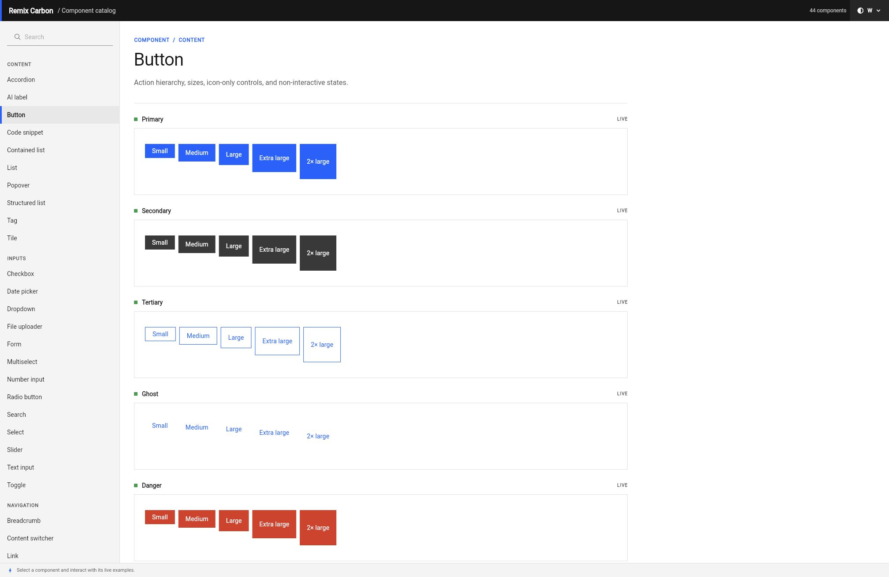

# Carbon for Flutter

A Flutter-native implementation of the [IBM Carbon Design System](https://carbondesignsystem.com),
built with Remix/Naked UI behavior and Mix styling foundations. The public API
is Carbon-specific; Remix and Mix are implementation details and are not
re-exported.

> **Status: pre-1.0.** The package covers all 41 component families in the
> pinned Carbon React 1.114.0 catalog plus three Carbon chart extensions. APIs
> can still change before the first stable release.

## Install

```yaml
dependencies:
  remix_carbon:
    git:
      url: https://github.com/btwld/remix.git
      path: packages/remix_carbon
```

## Quick start

Wrap an application or subtree in `CarbonScope`, then use Carbon components
and semantic tokens inside it.

```dart
import 'package:remix_carbon/remix_carbon.dart';

CarbonScope(
  theme: CarbonTheme.g100, // white | g10 | g90 | g100
  child: CarbonButton(
    label: 'Save',
    kind: CarbonButtonKind.primary,
    onPressed: () {},
  ),
);
```

## Component coverage

The catalog contains 44 tested families:

- Inputs and selection: Button, Checkbox, Content Switcher, Date Picker,
  Dropdown, File Uploader, Form, Multiselect, Number Input, Radio Button,
  Search, Select, Slider, Text Input and Toggle.
- Navigation and disclosure: Accordion, AI Label, Breadcrumb, Menu, Menu
  Button, Pagination, Popover, Tabs, Toggletip, Tooltip, Tree View and UI Shell.
- Content and feedback: Code Snippet, Contained List, Data Table, Inline
  Loading, Link, List, Loading, Modal, Notification, Progress Bar, Progress
  Indicator, Structured List, Tag and Tile.
- Data visualization: Bar Chart, Line Chart and Pie Chart.

The [component comparison matrix](reference/carbon_1_114_0/component_matrix.md)
records every public Carbon API, its official upstream family, and whether the
implementation is Carbon-native or reuses a Remix/Mix primitive. The machine-
readable source of truth is
[`manifest.json`](reference/carbon_1_114_0/manifest.json).

Remix-only Avatar, Badge, Card, Data List, Divider, Skeleton, Toggle Button and
Toggle Group are intentionally not added to the Carbon surface. Where Carbon
has a related but different concept—such as Tag, Tile, Contained List or
Content Switcher—the package exposes the Carbon contract instead.

## Component catalog

The example is a responsive, interactive catalog for every component family
across all four Carbon themes. Search or browse the component index, switch
themes, and exercise each component's live behavior:



```sh
cd packages/remix_carbon/example
flutter run -d chrome
```

The catalog is verified against the pinned manifest, smoke-tests every family,
and tests its responsive navigation and interactions:

```sh
flutter test
flutter build web --release
```

## Foundations

| API | Purpose |
| --- | --- |
| `CarbonScope` | Resolves Carbon tokens into a `MixScope`, selects a theme and accepts typed overrides. |
| `CarbonTheme` | `white`, `g10`, `g90`, `g100`, with matching brightness. |
| `CarbonLayer` | Resolves contextual layer, field and border roles for nested surfaces. |
| `CarbonLayoutScope` | Supplies contextual `CarbonSize` (`xs`–`x2l`) to components. |
| `CarbonType` | Provides fixed Mix tokens and viewport-aware fluid typography. |
| `CarbonMotion` | Provides intent-based easing and reduced-motion-aware durations. |

Token APIs are separated by intent:

- `CarbonTokens.*`: semantic color, spacing, size, type and motion roles.
- `CarbonComponentTokens.*`: component-specific roles.
- `CarbonPalette.*`: raw IBM Design Language colors, for cases where a
  semantic role does not apply.

```dart
import 'package:mix/mix.dart';

Box(
  style: BoxStyler()
      .color(CarbonTokens.layer01())
      .padding(EdgeInsetsMix.all(CarbonTokens.spacing05())),
);
```

## Icons

`remix_carbon` includes the complete 2,725-glyph Carbon Icons 11.86.0 32 px
catalog. Every glyph is a static `IconData` constant, allowing Flutter release
builds to subset the font to referenced glyphs:

```dart
const Icon(CarbonIcons.checkmark)
```

There is deliberately no runtime name-to-icon map because dynamic lookup would
keep the full catalog reachable. Pass `CarbonIcons` constants to any widget that
accepts `IconData`; Carbon controls use the same provider for their defaults.
All 2,725 glyphs convert losslessly. Five upstream Illustrator capability
wrappers are removed in a deterministic staging step while their static fallback
geometry and byte-identical original SVGs remain pinned and verified.

## Generation and provenance

Component wrappers use `mix_generator`; generated files are committed so
consumers do not run code generation. Maintainers can regenerate them with:

```sh
dart run build_runner build
```

Token values are generated from pinned official Carbon packages rather than
hand-copied. The pipeline and normalized snapshot live under `tool/`; verify
that a fresh generation is byte-identical with:

```sh
node tool/verify_generated.mjs
```

| Source | Pinned version |
| --- | --- |
| `@carbon/react` | 1.114.0 |
| `@carbon/styles` | 1.113.0 |
| `@carbon/themes` | 11.79.0 |
| `@carbon/colors` | 11.56.0 |
| `@carbon/layout` | 11.57.0 |
| `@carbon/type` | 11.65.0 |
| `@carbon/motion` | 11.50.0 |
| `@carbon/icons` | 11.86.0 |

Carbon repository commit:
`188d23202ec1092322dee92cf0df9d9958224ae4` (2026-08-13). Integrity hashes
and resolved tarballs for components and tokens are recorded in
`reference/carbon_1_114_0/manifest.json` and
`tool/upstream/carbon-source-lock.json`. The complete icon snapshot, original
license, per-file hashes, preparation contract, and npm integrity are recorded
under `reference/carbon_icons_11_86_0/`.

## Fonts

Carbon typography uses IBM Plex. The package does not bundle fonts; include
them in the application and select the family through the scope:

```dart
CarbonScope(
  theme: CarbonTheme.white,
  overrides: const CarbonThemeOverrides(
    fontFamily: CarbonFontFamilies.sans,
  ),
  child: app,
);
```

IBM Plex is licensed under the SIL Open Font License; see `NOTICE`.

## Licensing

Licensed under Apache-2.0. Carbon token values are derived from the Apache-2.0
IBM Carbon Design System. "IBM", "Carbon" and "IBM Plex" are IBM trademarks;
this is an independent community implementation. See `LICENSE` and `NOTICE`.
